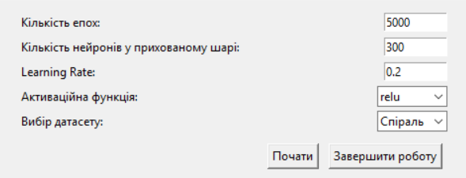
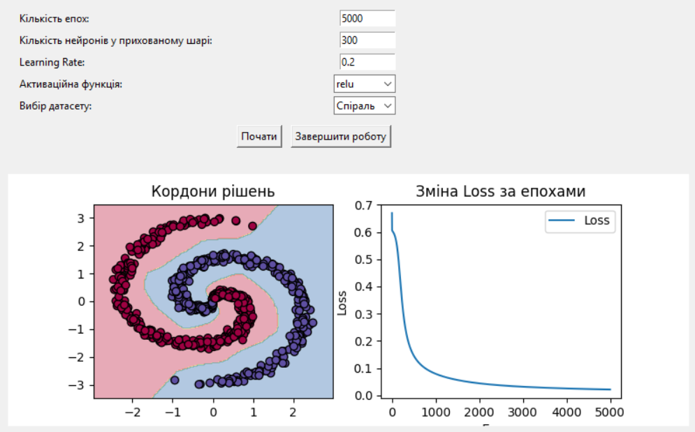

# Neural Network App v1.0

## Функціонал:
- Графічний інтерфейс для налаштування мережі  
- Вибір епох, кількості нейронів, learning rate  
- Підтримка різних датасетів  
- Візуалізація меж класифікації та зміни loss  

---

## Завантаження та встановлення
1. **Завантажте** Lab1.zip [GitHub Releases](https://github.com/shurochkaa/Lab1-Introduction-to-Deep-Learning-and-Neural-Network-Basics/releases/tag/1.0)
2. **Після встановлення** відкрийте ярлик Lab1.exe на робочому столі.

---

## Використання
1. **Відкрийте програму** та налаштуйте параметри:
   - Кількість епох
   - Кількість нейронів у прихованому шарі
   - Learning Rate
   - Вибір датасету
2. **Натисніть "Почати"** для тренування мережі.
3. **Переглядайте результати** на графіках меж класифікації та loss-функції.

